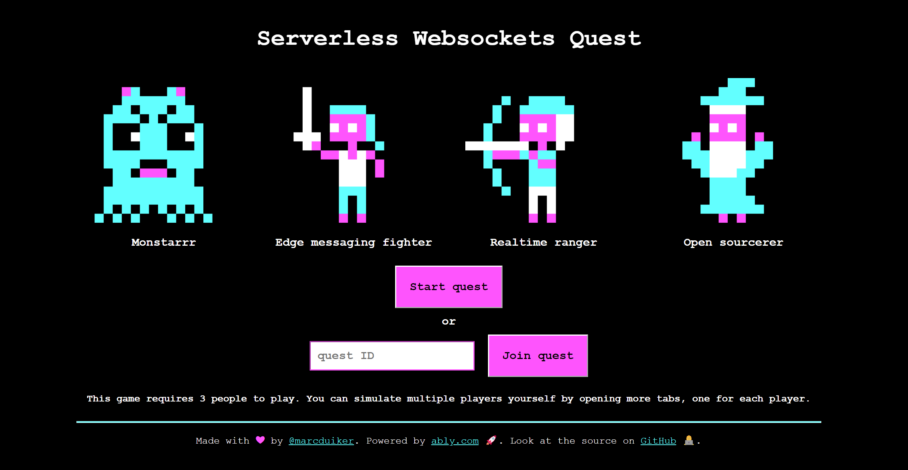
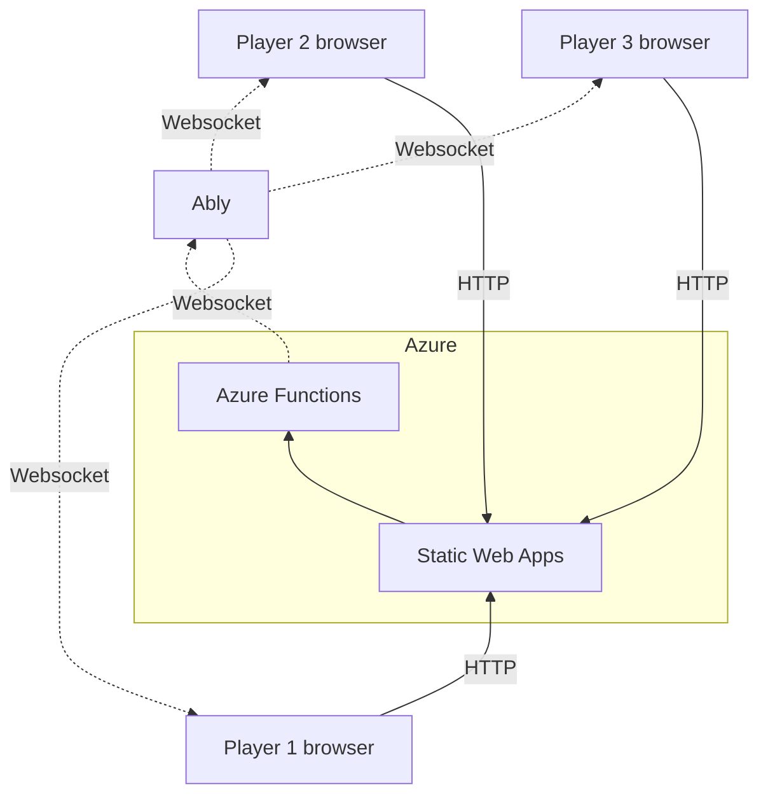

# Serverless Websockets Quest



## Description

This repository contains the code for the Serverless Websockets Quest, an ADND style game that demonstrates how to use serverless websockets with Ably & Azure Functions.

The players trigger HTTP based serverless functions to play the game. The functions manage the global game state (stored as Durable Entities) and use Ably to send messages to the connected clients to update the local game state in realtime. The functions only publish messages, the players only subscribe to them.



The game can be played online at [Serverless Websockets Quest](https://quest.ably.dev).

## Tech Stack

- [Azure Functions](https://docs.microsoft.com/azure/azure-functions/functions-overview), used as serverless compute to manage the game flow.
  - [Entity functions](https://docs.microsoft.com/azure/azure-functions/durable/durable-functions-entities?tabs=csharp), used to persist the overall game & player state.
- [Ably](https://ably.com/), used as the serverless websockets to broadcast the game & player state to the clients in realtime.
- [VueJS](https://vuejs.org/), used as the front-end framework for the game.
- [Azure Static Web Apps](https://docs.microsoft.com/azure/static-web-apps/overview), used as the hosting solution in the cloud.


## Running locally

You require the following dependencies:

- [.NET 6](https://dotnet.microsoft.com/download/dotnet/6.0). The .NET runtime required for the C# Azure Functions.
- [Node 16](https://nodejs.org/en/). The JavaScript runtime required for the Vue front-end.
- [Azure Functions Core Tools](https://docs.microsoft.com/azure/azure-functions/functions-run-local?tabs=v4%2Cwindows%2Ccsharp%2Cportal%2Cbash). This is part of the Azure Functions extensions for VSCode that should be recommended for automatic installation when this repo is opened in VSCode.
- [Azurite](https://marketplace.visualstudio.com/items?itemName=Azurite.azurite). This is an local storage emulator that is required for Entity Functions. When this repo is opened in VSCode a message will appear to install this extension.
- [Azure Static Web Apps CLI](https://github.com/Azure/static-web-apps-cli). Install this tool globally by running this command in the terminal: `npm install -g @azure/static-web-apps-cli`.
- A free Ably Account, [sign up](https://ably.com/signup) or [log in](https://ably.com/login) to ably.com, and [create a new app and copy the API key](https://faqs.ably.com/setting-up-and-managing-api-keys).

### Steps

1. Clone this repo.
2. Run `npm install` in the root folder.
3. Rename the `api\local.settings.json.example` file to `api\local.settings.json`.
4. Copy/paste the Ably API key in the `ABLY_APIKEY` field in the `local.settings.json` file.
5. Start Azurite (VSCode: `CTRL+SHIFT+P -> Azurite: Start`)
6. Run `swa start` in the root folder.

<details>
    <summary>Open the browser and navigate to <code>http://localhost:4280/</code>.</summary>

You'll see this error message but you can ignore it as long as you're running the solution locally:

```cmd
Function app contains non-HTTP triggered functions. Azure Static Web Apps managed functions only support HTTP functions. To use this function app with Static Web Apps, see 'Bring your own function app'.
```

The terminal will eventually output this message that indicates the emulated Static Web App is running:

```cmd
Azure Static Web Apps emulator started at http://localhost:4280. Press CTRL+C to exit.
```

</details>

## Contributing

Want to help contributing to this project? Have a look at our [contributing guide](CONTRIBUTING.md)!

## More info

For more questions or comments, please contact me on [Twitter](https://twitter.com/marcduiker) on our Ably Discord.

- [Join our Discord server](https://discord.gg/q89gDHZcBK)
- [Follow us on Twitter](https://twitter.com/ablyrealtime)
- [Use our SDKs](https://github.com/ably/)
- [Visit our website](https://ably.com)

---
[](https://ably.com)